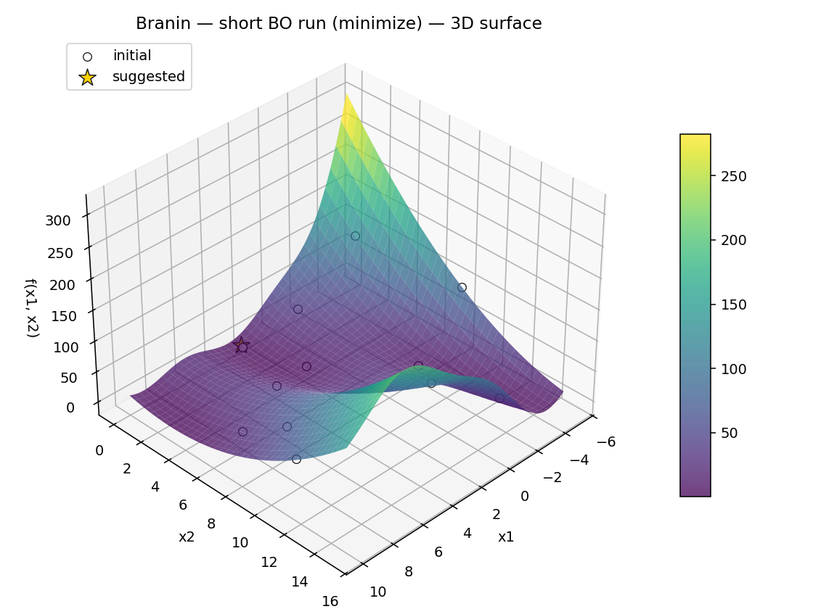

<h1 align="center">SATOR Engine</h1>
<p align="center">
  Statistical Adaptive Tuning and Optimization Runtime </br>
  >^o,o^<
  Stateless multi‑objective optimization engine for continuous spaces
</p>
<p align="center">
  <a href="https://github.com/WytchDocQ/SatorOptimizer/actions/workflows/ci.yml">
    
  </a>
  <a href="https://www.apache.org/licenses/LICENSE-2.0.txt">
    
  </a>
  
</p>

SATOR is an open-source, stateless optimization engine for black-box, multi-objective problems. It focuses on practical defaults, clear APIs, and production-friendly behavior without external dependencies.

SATOR was originally built for chemical formulations and material compositions, and generalizes to any optimization problem in continuous spaces. It supports two input classes: (1) compositional “ingredients” that must sum to one (typical for mixtures), and (2) free parameters normalized independently. This lets you combine mixtures and standard continuous variables in a single problem, making SATOR suitable for a wide range of numerical optimization tasks—from industrial process tuning to optimizing parameters for algorithmic trading.

## Table of contents
- What it is
- What the system can currently do
- Use cases
- Run it
- Configuration
- Try an optimization
- Documentation
- Stewardship & Governance
- License

## What it is
- Multi-objective Bayesian optimization server with HTTP API
- Deterministic, async-capable execution with concurrency controls
- Optional PCA encoding with GP maps:
  - 1D → curve map
  - 2D → surface map
  - 3D → volumetric map
  - >3D → no plot
- High-precision SLSQP reconstruction back to the original variables (sum-to-one respected)
- No database, no UI – simple to deploy and operate

What the system can currently do
- Suggest next experiments for single or multiple objectives (qEHVI/qNEHVI, ParEGO, qEI/qPI/qUCB)
- Handle objective goals: min, max, target, explore/probe, improve, and threshold/range types
  - minimize_below, maximize_above, maximize_below, minimize_above, within_range
- Apply constraints: bounds, sum-to-one, ratios
- Fit GP models in input or PCA space and return visualization-ready GP maps (PCA 1D/2D/3D)
- Automatically reconstruct PCA-space predictions back to original variables (sum-to-one respected)

## Use cases
- Chemical formulation and material composition optimization (mixtures with sum‑to‑one constraints)
- Process tuning with mixed continuous parameters
- Hyperparameter/parameter search for algorithmic trading strategies
- Any black‑box optimization in continuous domains where sample efficiency matters

## A quick look


Run it (easiest way)
- Press F5 in VS Code/Cursor and choose “SATOR: Run Server” (we ship a ready-to-use `.vscode/launch.json`)
- Or in a terminal: `sator-server` (with the venv activated)

Configuration
- Set a single API key in `.env`:
  - `SATOR_API_KEY=dev-key`
- Health checks: `/livez`, `/readyz` on `http://localhost:8080`

Try an optimization
```bash
curl -s -H "x-api-key: dev-key" -H "Content-Type: application/json" \
  -d '{"dataset":{},"search_space":{"parameters":[{"name":"x1","type":"float","min":0,"max":1}]},"objectives":{"o1":{"goal":"min"}},"optimization_config":{"acquisition":"qnehvi","batch_size":2,"max_evaluations":10}}' \
  http://localhost:8080/v1/optimize
```

Documentation
- See `docs/` for quickstart, API reference, objectives, advanced numerical settings, and operations.
- Release notes live in `CHANGELOG.md`. Known issues live in `docs/known_bugs.md`.

Stewardship & Governance
- This project is created and maintained by Sysnoid Technologies Oy. We welcome
  contributions from the community via pull requests. By contributing, you agree
  that your changes are licensed under Apache‑2.0, the same license as this repository.
- See `CONTRIBUTING.md` for guidelines and `SECURITY.md` for vulnerability reporting.
- Attribution: Contributors will be credited in the git history and release notes.

License
- Apache-2.0 (see `LICENSE`).
  - License text: [Apache License 2.0](https://www.apache.org/licenses/LICENSE-2.0.txt)